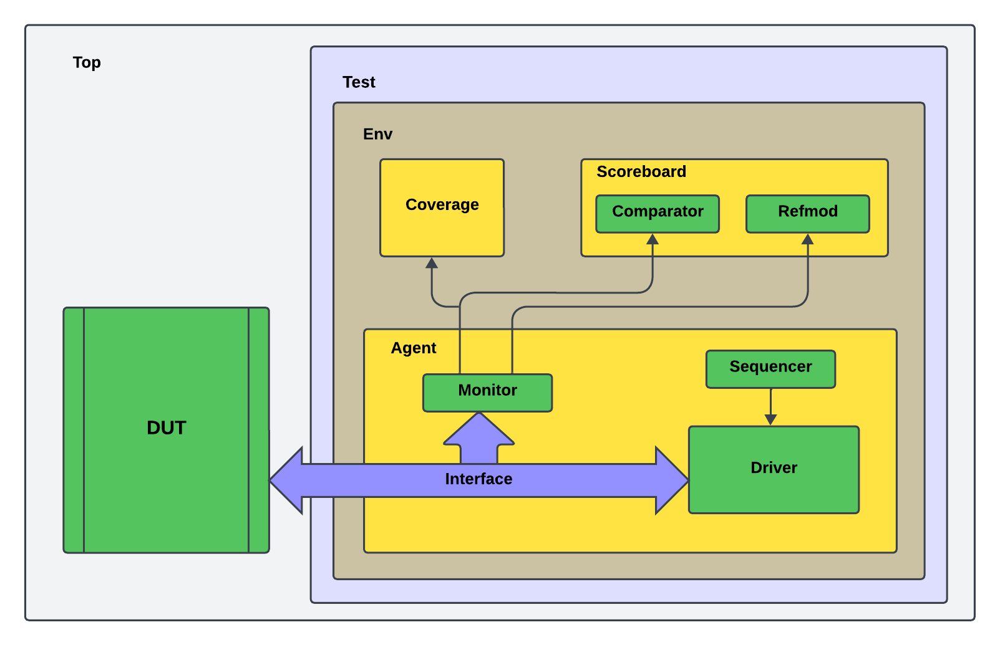

# Ambiente de verificação para o Decodificador de Huffman.

## Índice
- [Plano de Verificação](#Plano-de-Verificação)
- [Estrutura do ambiente UVM](#Estrutura-do-ambiente-UVM)
- [Recursos](#Recursos)
- [Simulação](#Simulação)
- [Autor](#Autor)
- [Licença](#Licença)

## Plano de Verificação

```
- O plano de verificação se encontra num arquivo README dentro da pasta "tb".
```

## Estrutura do ambiente UVM
Ambiente básico de um testbench UVM.



### Recursos:

```
UVM 1.2

Licença Cadence/Xcelium.
```

## Simulação

Para iniciar a simulação utilize o comando make.

```
make
```

## Autor

* **André Medeiros** - [André Medeiros](https://github.com/andreemedeiros)

Contribuição no projeto [Dec_Huffman_UVM](https://github.com/andreemedeiros/Dec_Huffman_UVM/graphs/contributors).

## Licença

Este projeto está licenciado sob a MIT License - veja a [LICENSE.md](LICENSE.md) para mais detalhes.
